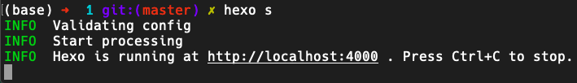

## 本地部署

使用下面的这条命令，部署hexo的本地server，着能够测试你的环境是否全部安装完成，安装是否存在问题。

```bash
$ hexo clean && hexo s -debug
```

成功启动 <http://localhost:5000> ，打开且无报错

下面这条报错可以忽略，其他报错则需要自行排除bug

```bash
(node:11248) [DEP0066] DeprecationWarning: OutgoingMessage.prototype._headers is deprecated
```

### 部署本地server失败解决方法

如果您在上一步初始化server时候出现了问题，您可以查看这一个步骤来尝试解决您的问题：[[自我bug排除和修复]]

至此，您已经初步配置好环境了。

## 使用vercel等持续集成服务,部署到服务器上（以vercel为例）

此处转载自： [Vercel + Hexo 免费搭建自用博客保姆级教程 | NEROASMARA.TOP - <https://neroasmar.top/](https://neroasmar.top/hexo-building/)>

傻瓜式多图介绍如何使用 Vercel 免费搭建一个 Hexo 博客。

## 0 开始前的准备

> 需要准备
>
> Vercel 账号、Github 账号、本地 Git 环境

有关于如何配置本地 Git 环境，可以搜其他的教程，有很多。

Vercel 为开发者提供免费的一键式托管服务，可以通过导入主流的代码托管平台的项目来进行静态网站托管。选择 Vercel 的原因不仅是因为其完全免费，而且在国内环境下，其部署的网站访问速度也算是一流。

这里我们选择从 Github 这个使用最广泛的托管平台进行导入部署。

##1 Hexo 上传至 Github

### 1.1 本地部署 Hexo

命令如下：

    npm install hexo-cli -g
    hexo init blog
    cd blog
    npm install
    hexo server

根据 [Hexo 官网](https://hexo.io/zh-cn/) 初始化一个 Hexo 博客文件夹在目录 `blog` 中，最后 `hexo server` 为本地运行查看博客，最后像这样便运行成功了：



最后在本地的浏览器里面输入 `http://localhost:5000/` 便可看见 Hexo 博客样式（我们修改了默认端口为5000），有关于更多的 Hexo 信息修改，主题更换可以直接参考 [Hexo 官网](https://hexo.io/zh-cn/) 文档与教程介绍。

### 1.2 Hexo 文件夹创建为 Git 仓库

    cd ..
    git init blog

退到 Hexo 文件夹上一级目录，并将其文件夹初始为 Git 仓库，方便后面将其传到 Github 上。当成功后，进入 blog 文件夹就可以看见 .git 文件夹。

### 1.3 Hexo 文件夹仓库上传到 Github

首先在 Github 中新建一个仓库，由于其中会有个人文章信息什么的，最好将其设置为私人仓库。


然后我们进入本地 Hexo 文件夹，因为从未绑定过 Github 远程仓库，所以先要用命令绑定，再将其博客文件上传到 Github 远程仓库，命令如下：

    cd blog
    git remote add origin git@github.com:用户名/仓库名.git
    git add --all
    git commit -m 'first commit'
    git push -u origin master

然后进入 Github 就应该能看见 Hexo 文件内容已经被上传了。注意这里 Public 这些框架解析的网页文件是没有被上传的，因为被 .gitignore 忽略了，后面使用 Vercel 连接本仓库也是不需要 Public 这类文件夹的。

## 2 Vercel 部署一个 Hexo 博客

注册账号进入 [Vercel 官网](https://vercel.com/) 后，如果不是使用 Github 账号登录注册的话，需要去个人设置里面，将 Vercel 账号与 Github账号进行关联。


然后回到 Overview ，选择 Import Project，选择从 Github 导入，然后填写自己的 Github 博客项目链接，点击 continue 继续。


这里出现的选项默认即可，如果想了解可以点开看一下解释，但是最好确保自己知道选项含义再去做修改。


最后点击 Deploy 部署即可，最后一阵子等待后，出现撒花花界面，就部署成功了！现在点击 Visit 就可以直接查看博客的样式了！享受第一个属于自己的网站吧。

博客的网页链接是 Vercel 提供的，最后在此项目的控制面板里面可以看见 Vercel 提供的几个测试域名，运行状态，项目信息，日志等信息。


## 3 绑定自己的域名

因为部署的博客默认是使用的 Vercel 提供的测试域名，如果想要是换成自己的域名，需要先进入博客项目的 Setting - Domains 进行添加。比如我这里想添加我的 blog.neroasmar.top 为博客的域名，填入 blog.neroasmar.top 会被报错要求进行解析：


我们这时就需要去自己域名的提供商的 DNS 解析管理系统里面去添加这里 Vercel 要求添加的记录，比如我的是阿里云的域名，进入阿里云的解析设置里面，为 neroasmar.top 域名添加一个解析，选项就使用上图 Vercel 要求的选项填入，然后确定。


最后回到 Vercel 中，几秒钟后便可以看见域名已经设置成功可以使用了，然后进入设置的域名便可以看见自己部署的 Hexo 博客了。


后面便可以使用 Hexo 博客框架进行自由的写作，发布自己的想法了！尽情开启自己的创作吧。

## 4 后续的维护与使用

如果是在本地更新了文章想要发布、对 Hexo 更换了主题、或者是修改了 Hexo 的配置、添加了插件等，依然是可以使用上述的 git 命令添加文件夹上传至 Github，然后等待几分钟后，Vercel 便会自动将 Github 仓库里的最新提交进行解析部署，然后成功后会发一封邮件至绑定邮件提醒博客已经更新（可关闭），然后去自己的博客网站就可以看见自己做的修改或者最新的文章已经能看见了。

最后更新于：周三 12月 30 2020

## 本地生成

使用下列命令在本地生成网页

```bash
hexo g
```

您也可以加上-force后缀来强制重新生成网页

```bash
hexo g -f
```

## 使用hexo原生的在线部署服务

使用hexo原生的在线部署服务,生成网页并且在线部署,可以部署到GitHub Pages或者其他pages服务

```bash
hexo g -d
```

合并清理命令：

```bash
hexo clean && hexo g -d
```

## 一键发布 deploy(方案2)

新建`hexo-publish.bat`,内容为

```bash
hexo g -d
```

实际操作过程只是执行了`hexo g -d`命令

## 结束语

test
