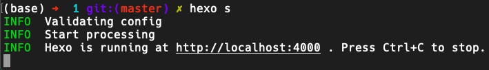

> You must have a positive self perception in order to transcend anything.
> — <cite>Steve Maraboli</cite>

点击回到hexo项目的配置文档: [[安装与配置]]

## Linux环境使用n作为包管理器

在Linux上建议安装n，这十分简便，见:

您可能在某些地区无法下载node，于是您可能要增加一个代理：

### n增加proxy

## Windows环境使用nvm for windows

在Windows上推荐使用nvm for windows:[coreybutler/nvm-windows: A node.js version management utility for Windows. Ironically written in Go. - <https://github.com/](https://github.com/coreybutler/nvm-windows)>

对于nvm：

```shell
nvm ls
nvm uninstall 14.5.4
nvm install 14.5.4
nvm use 14.5.4
```

您可能在某些地区无法下载node，于是您可能要增加一个代理：

### nvm增加proxy

nvm设置代理

```shell
nvm proxy 127.0.0.1:7890
nvm install 14.5.4
```

## 安装博客的所有依赖

接下来,来到博客根目录,使用安装命令

```shell
npm i
```

众所周知，npm是一种使用体验很糟糕的包管理器，

或者使用yarn(推荐)

```shell
yarn install
```

中国大陆地区可能无法下载node的相关依赖,您可能需要更换镜像源,或者使用代理

### 使用nrm切换镜像源

**安装 nrm**

```cmd
npm i -g nrm
```

**nrm查看下载镜像源**

```cmd
nrm ls
```

**nrm切换镜像源**

```cmd
nrm use taobao
```

### 使用代理proxy

见

### 安装node js相关依赖时出现了问题,安装了错误的node依赖，或者您遇到了未知bug

当您安装了错误的node依赖，或者您遇到了未知bug，可以尝试**重新安装node依赖**

linux中:

```bash
rm -rf node_modules/ && npm i
```

windows中:
删除node_modules文件夹并执行

```bash
npm i
```

## 安装依赖后进行环境测试

在安装好nodejs依赖后,您需要进行一次node.js依赖测试

使用下面的命令，部署hexo的本地server，着能够测试你的环境是否全部安装完成，安装是否存在问题。

命令如下：

```shell
    cd blog #博客根目录
    npm install
    hexo clean && hexo s -debug
```

根据 [Hexo 官网](https://hexo.io/zh-cn/) 初始化一个 Hexo 博客文件夹在目录 `blog` 中，最后 `hexo server` 为本地运行查看博客，最后像这样便运行成功了：



最后在本地的浏览器里面输入

```text
http://localhost:5000/
```

便可看见 Hexo 博客样式（我们修改了默认端口为5000），打开且无报错

下面这条报错可以忽略，

```bash
(node:11248) [DEP0066] DeprecationWarning: OutgoingMessage.prototype._headers is deprecated
```

其他报错则需要自行排除bug,见,

### 环境测试时,部署本地server失败

解决方法：您可以查看这一个步骤来尝试解决您的问题：[[自我bug排除和修复]]

### 更换了端口？

因为中国用户经常遇到端口占用问题，我更改了默认的server端口，变为了`5000`您可以点击这里了解：[[更换hexo的默认server端口]]

### 某些文件夹被gitignore忽略了?

`Public` 这些本地部署所生成的文件夹是不用被上传的，我们的方案不需要他们,这里已经被 `.gitignore` 忽略了.

后面使用 `Vercel` 连接您的GitHub博客仓库也是不需要 `Public` 这类文件夹的。

## 结束语

到了这，您的相关环境就配置完成了，

您可以进行下一步，将您的本地博客部署到在线服务器上去，见：[[部署到vercel]]
