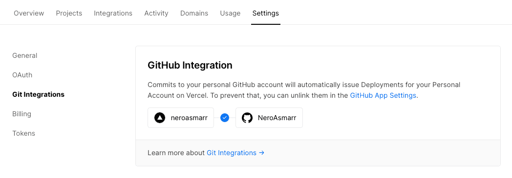
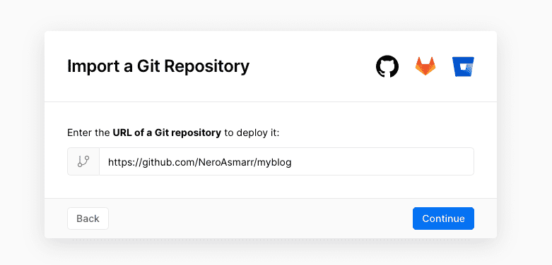
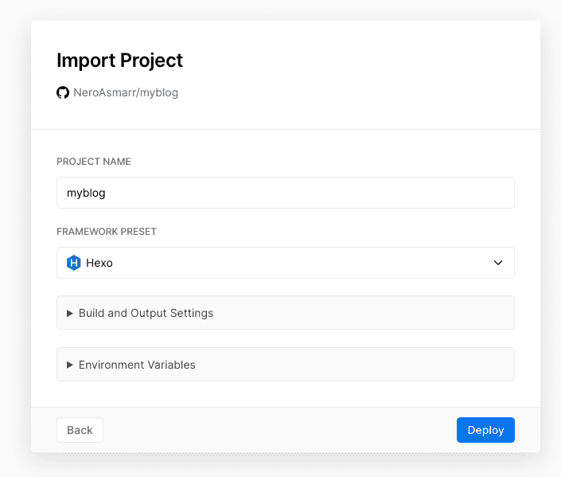
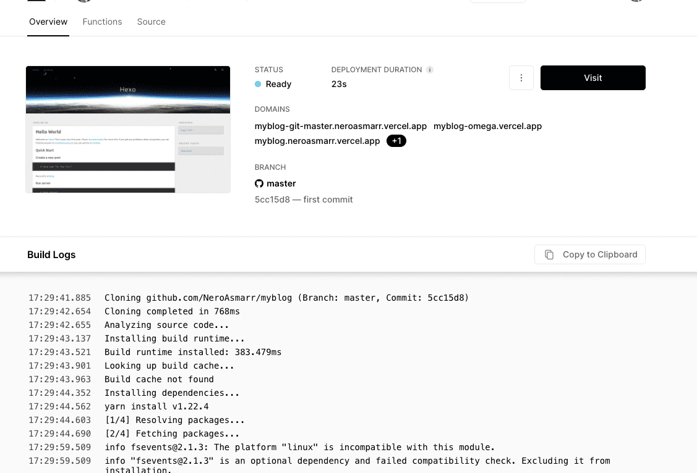

## 使用vercel等持续集成服务,部署Hexo 博客到服务器上（以vercel为例）

当您在博客文件夹内写好一篇文章后(已经默认附带一篇文章)，您可以将您写好的文章发布到您的在线博客，这一过程称为项目部署。

至此，您可以准备部署到服务器了

Vercel 为开发者提供免费的一键式托管服务，可以通过导入主流的代码托管平台的项目来进行静态网站托管。选择 Vercel 的原因不仅是因为其完全免费，而且在国内环境下，其部署的网站访问速度也算是一流。

注册账号进入 [Vercel 官网](https://vercel.com/) 后，如果不是使用 Github 账号登录注册的话，需要去个人设置里面，将 Vercel 账号与 Github账号进行关联。

然后回到 Overview ，选择 Import Project，选择从 Github 导入，然后填写自己的 Github 博客项目链接，点击 continue 继续。

这里出现的选项默认即可，如果想了解可以点开看一下解释，但是最好确保自己知道选项含义再去做修改。

最后点击 Deploy 部署即可，最后一阵子等待后，出现撒花花界面，就部署成功了！现在点击 Visit 就可以直接查看博客的样式了！享受第一个属于自己的网站吧。

博客的网页链接是 Vercel 提供的，最后在此项目的控制面板里面可以看见 Vercel 提供的几个测试域名，运行状态，项目信息，日志等信息。

## 结束语

到这里,您的部署已经结束了,

后面便可以使用 Hexo 博客框架进行自由的写作，发布自己的想法了！尽情开启自己的创作吧。

下一步，您可以开始写下您的第一篇文章，见：[[写文章]]
